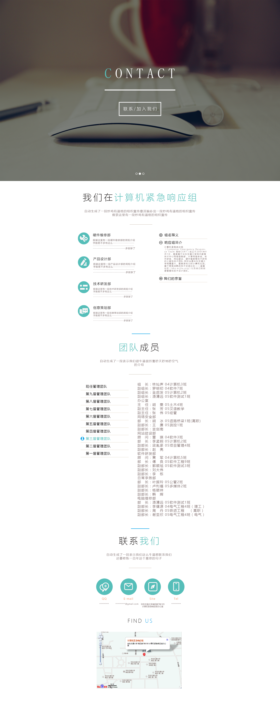

#计算机紧急响应组官网重建需求整理

##菜单结构
```
├─首页
├─部门介绍  
│  ├─创意策划部
│  ├─产品运营部
│  ├─技术研发部
│  ├─硬件维修部
│  ├─……
├─名人堂
│─社团博客
│─团队作品
│  ├─花椒校园通
│  ├─……
│─关于我们
│  ├─社团简介
│  ├─管理团队
│  ├─加入我们
│  └─联系方式
```
##菜单说明
###首页
采用纵向长滚动设计布局  
当进入页面，先使用fakeloader.js模拟预加载效果，优化用户体验
随后，标题从浏览器顶部淡入  
底部的前两个箭头上下浮动，光芒轻轻闪烁  
使用大图作为背景，几句简单有力的介绍，一个“加入我们”的按钮  
菜单的焦点右边光标闪烁  

####Gorgiax设计的首页页面
部分元素参考耶稣君的设计(东方的背景太中二，请无视，暂时没有社团照片，等我找时间去拿)


####Gorgiax设计的部门页面
部分元素参考耶稣君的设计(东方的背景太中二，请无视，暂时没有社团照片，等我找时间去拿)


####耶稣君设计的部分页面


###部门介绍
不排除以后部门会有变动，所以不要固定数量，横向平均分成n个部分。  
每个部分都有一个背景图和部门名称。  
饱和度和亮度默认降低，获得鼠标焦点恢复亮度和饱和度，出现简短有力的文字介绍  
点击任意部门后，出现涟漪效果展开，其余的部门分别迅速向两边移动，使用3D动画。

###部门详情
背景图完全展示，显示部门名称和详细介绍。  
向下滚动，展示部门成员，每个成员显示自定义头像，名称，他人介绍(一定要他人介绍)，联系方式。

###名人堂
像部门详情的第二页一样，照片也可以为头像，介绍就由自己写了。

###社团博客
社团运营的博客，由每个写博客的成员投稿。

###团队作品
列出所有作品中等大小的图片，点击进入相应详情页。

###关于我们
先是简介，向下滚动出现管理团队，管理团队由左边的标签来分页，内容由后台生成。  
再向下滚动出现加入我们的页面，几句要求，一个按钮，一幅背景图。
最后是联系我们的页面，负责人E-Mail，地址，电话，负责老师，地图。


##后台
###成员表结构
```SQL
CREATE TABLE `members` (
  `id` int(4) unsigned NOT NULL AUTO_INCREMENT,
  `student_id` varchar(16) NOT NULL DEFAULT '' COMMENT '学号',
  `username` varchar(10) NOT NULL DEFAULT '' COMMENT '姓名',
  `classname` varchar(16) NOT NULL DEFAULT '' COMMENT '班级',
  `department_id` int(2) NOT NULL DEFAULT '' COMMENT '部门id',
  `position_id` int(2) NOT NULL DEFAULT '' COMMENT '职位id',
  `join_time` datetime NOT NULL DEFAULT '' COMMENT '加入时间',
  `face_id` int(4) NOT NULL DEFAULT '' COMMENT '头像id',
  `introduction` varchar(255) NOT NULL DEFAULT '' COMMENT '个人介绍',
  `link` varchar(160) NOT NULL DEFAULT '' COMMENT '链接',
  `show_depart` bit NOT NULL DEFAULT 0 COMMENT '在部门里展示',
  `show_famehall` bit NOT NULL DEFAULT 0 COMMENT '在名人堂里展示',
  `create_time` datetime NOT NULL COMMENT '创建时间',
  `update_time` timestamp NOT NULL DEFAULT CURRENT_TIMESTAMP ON UPDATE CURRENT_TIMESTAMP COMMENT '更新时间',
  PRIMARY KEY `id`,
  UNIQUE KEY `student_id`
) ENGINE=InnoDB AUTO_INCREMENT=1 DEFAULT CHARSET=utf8;
```
###部门表结构
```SQL
CREATE TABLE `department` (
  `id` int(2) unsigned NOT NULL AUTO_INCREMENT,
  `department_name` varchar(16) NOT NULL DEFAULT '' COMMENT '部门名',
  `department_name_en` varchar(24) NOT NULL DEFAULT '' COMMENT '部门英文标识',
  `brief` varchar(120) NOT NULL DEFAULT '' COMMENT '部门简介',
  `introduction` varchar(400) NOT NULL DEFAULT '' COMMENT '部门介绍',
  `background` varchar(160) NOT NULL DEFAULT '' COMMENT '部门主题背景',
  `order` int(2) NOT NULL DEFAULT 1 COMMENT '部门显示顺序',
  `flag` bit NOT NULL DEFAULT 1 COMMENT '部门是否运作',
  `create_time` datetime NOT NULL COMMENT '创建时间',
  `update_time` timestamp NOT NULL DEFAULT CURRENT_TIMESTAMP ON UPDATE CURRENT_TIMESTAMP COMMENT '更新时间',
  PRIMARY KEY `id`
) ENGINE=InnoDB AUTO_INCREMENT=1 DEFAULT CHARSET=utf8;
```

###职位表结构
```SQL
CREATE TABLE `position` (
  `id` int(2) unsigned NOT NULL AUTO_INCREMENT,
  `position_name` varchar(16) NOT NULL DEFAULT '' COMMENT '职位名',
  `position_name_en` varchar(24) NOT NULL DEFAULT '' COMMENT '职位英文标识',
  `weight` int(2) NOT NULL DEFAULT '' COMMENT '权重',
  `order` int(2) NOT NULL DEFAULT 1 COMMENT '职位显示顺序',
  `department_id` int(2) NOT NULL DEFAULT '' COMMENT '部门id',
  `create_time` datetime NOT NULL COMMENT '创建时间',
  `update_time` timestamp NOT NULL DEFAULT CURRENT_TIMESTAMP ON UPDATE CURRENT_TIMESTAMP COMMENT '更新时间',
  PRIMARY KEY `id`
) ENGINE=InnoDB AUTO_INCREMENT=1 DEFAULT CHARSET=utf8;
```

###团队作品表结构
```SQL
CREATE TABLE `product` (
  `id` int(2) unsigned NOT NULL AUTO_INCREMENT,
  `product_name` varchar(16) NOT NULL DEFAULT '' COMMENT '作品名',
  `product_name_en` varchar(24) NOT NULL DEFAULT '' COMMENT '作品英文标识',
  `thumb_img` varchar(16) NOT NULL DEFAULT '' COMMENT '预览图',
  `weight` int(2) NOT NULL DEFAULT '' COMMENT '权重',
  `order` int(2) NOT NULL DEFAULT 1 COMMENT '显示顺序',
  `create_time` datetime NOT NULL COMMENT '创建时间',
  `update_time` timestamp NOT NULL DEFAULT CURRENT_TIMESTAMP ON UPDATE CURRENT_TIMESTAMP COMMENT '更新时间',
  PRIMARY KEY `id`
) ENGINE=InnoDB AUTO_INCREMENT=1 DEFAULT CHARSET=utf8;
```

###管理团队表结构
```SQL
CREATE TABLE `leadership` (
  `id` int(2) unsigned NOT NULL AUTO_INCREMENT,
  `username` varchar(10) NOT NULL DEFAULT '' COMMENT '姓名',
  `department_name` varchar(16) NOT NULL DEFAULT '' COMMENT '部门名',
  `position_name` varchar(16) NOT NULL DEFAULT '' COMMENT '职位名',
  `generation`  int(2) NOT NULL DEFAULT '' COMMENT '届数',
  `create_time` datetime NOT NULL COMMENT '创建时间',
  `update_time` timestamp NOT NULL DEFAULT CURRENT_TIMESTAMP ON UPDATE CURRENT_TIMESTAMP COMMENT '更新时间',
  PRIMARY KEY `id`
) ENGINE=InnoDB AUTO_INCREMENT=1 DEFAULT CHARSET=utf8;
```